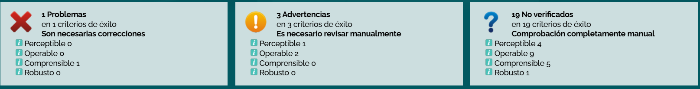
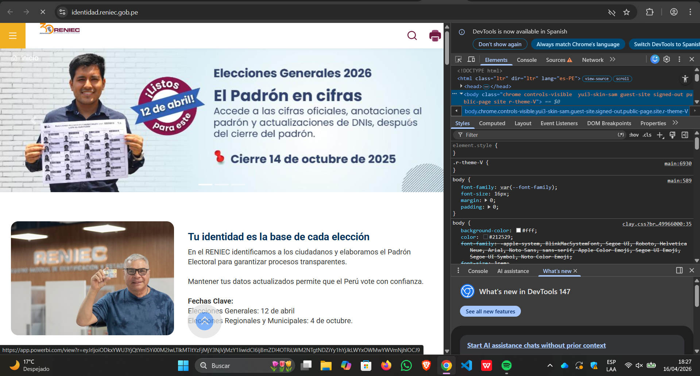
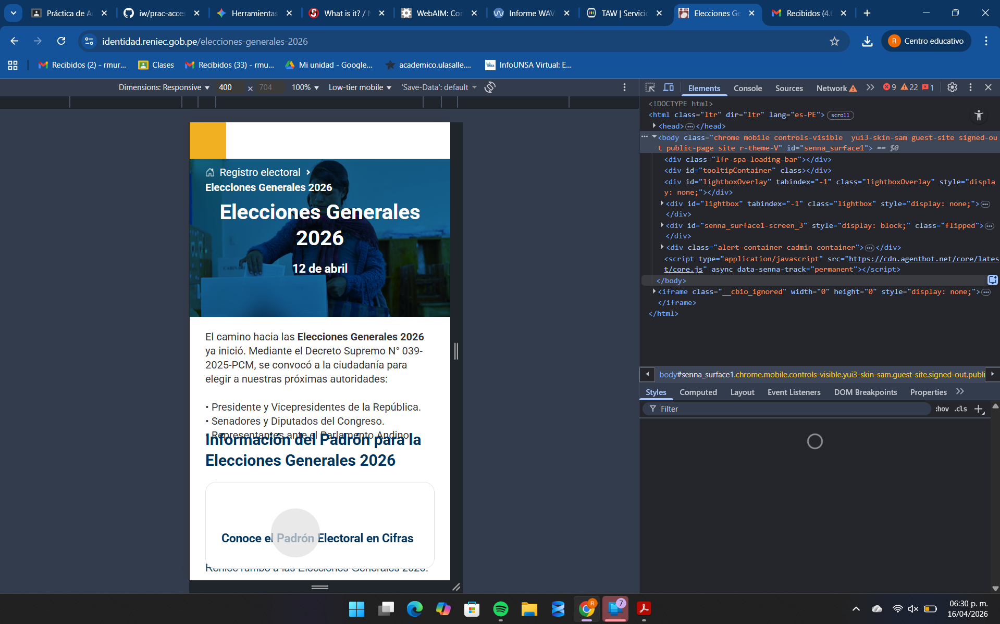
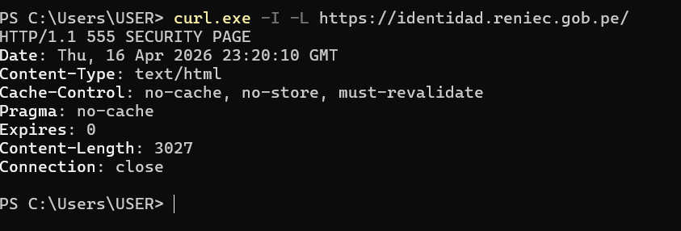
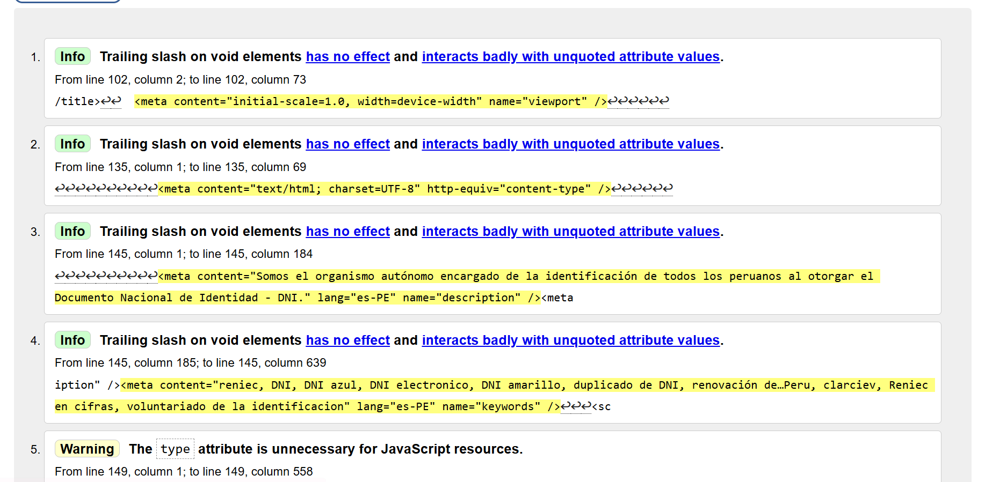
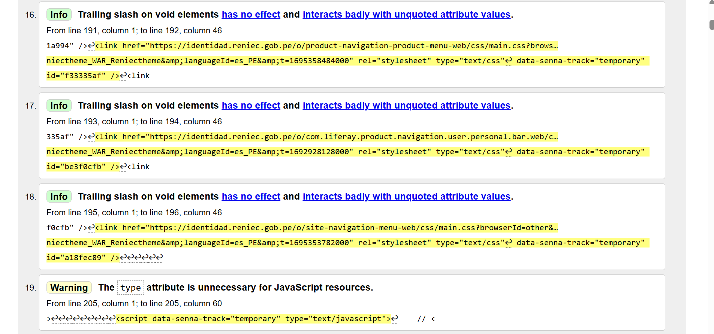

# Informe de Accesibilidad Web - RENIEC

## 📘 Curso
**Ingeniería Web**

## 👥 Integrantes

| Integrante           | Participación |
|--------------------|--------------|
| Diego Nova         | 100%         |
| Renzo Murillo      | 100%         |
| Angelica Castillo  | 100%         |
| Marcelo Silva      | 100%         |

---

## 📌 Objetivo

Evaluar la accesibilidad del sitio web de RENIEC utilizando herramientas y pruebas manuales, considerando los principios de accesibilidad web: perceptible, operable, comprensible y robusto.

---

## 🌐 Sitio Evaluado

- URL: *https://identidad.reniec.gob.pe/*
- Fecha de evaluación: *16/04/2026*

---

## 🛠️ Herramientas Utilizadas

- TAW (Test de Accesibilidad Web)
- Contrast Checker
- Navegador web (modo sin JavaScript)
- Herramientas de desarrollo del navegador

---

## 🔍 Evaluación de Accesibilidad (TAW)

### 1. Perceptible

**Descripción:**
El principio perceptible establece que la información y los componentes de la interfaz deben presentarse de forma que los usuarios puedan percibirlos, ya sea mediante la vista, el oído u otros sentidos. Esto incluye el uso adecuado de textos alternativos, contraste de colores y estructura visual clara.

**Resultados:**

La auditoría realizada con la herramienta TAW muestra un análisis general del cumplimiento de las WCAG (Pautas de Accesibilidad para el Contenido Web), clasificando los hallazgos en problemas, advertencias y elementos no verificados.

En relación con el principio **Perceptible**, no se detectaron errores automáticos críticos. Sin embargo, se identificaron aspectos que requieren revisión manual:

- **Problemas automáticos:** 0  
- **Advertencias:** 1  
- **Criterios no verificados:** 4  

Esto indica que, aunque no existen fallos evidentes detectados automáticamente, hay varios aspectos importantes que deben evaluarse manualmente, como:
- Uso correcto de textos alternativos en imágenes
- Contraste de colores adecuado
- Adaptabilidad del contenido a diferentes dispositivos o condiciones visuales

**Evidencias:**

**Problemas detectados:**
- Posible ausencia o uso inadecuado de atributos `alt` en imágenes.
- Contenido visual que podría no ser completamente accesible para usuarios con discapacidad visual.
- Falta de validación manual en elementos perceptibles importantes como multimedia o iconografía.
- Posibles problemas de contraste que no fueron completamente verificados automáticamente.

**Propuesta de mejora:**
- Implementar textos alternativos (`alt`) descriptivos en todas las imágenes.
- Verificar y asegurar un adecuado contraste de colores (mínimo WCAG AA).
- Incluir subtítulos o transcripciones en contenido multimedia.
- Validar manualmente todos los elementos visuales críticos del sitio.
- Aplicar buenas prácticas de diseño accesible para garantizar que la información sea clara y distinguible para todos los usuarios.

---

## 🎨 Prueba de Contraste de Color

**Herramienta:** Contrast Checker

Se evaluó la legibilidad de la combinación de colores principal del portal de RENIEC (azul institucional sobre fondo amarillo) utilizando la herramienta **WebAIM Contrast Checker**, con el objetivo de verificar el cumplimiento de los estándares de accesibilidad para personas con baja visión o daltonismo.

---

### A. Resultados de la Evaluación

- **Color de fondo:** #F1B02F (Amarillo / Dorado)  
- **Color de texto:** #275472 (Azul institucional)  
- **Relación de contraste:** **4.23:1**

---

### B. Nivel de Cumplimiento

| Elemento                | Estándar WCAG | Resultado | Estado       |
|------------------------|--------------|----------|-------------|
| Texto normal           | AA (4.5:1)   | 4.23:1   | ❌ No cumple |
| Texto grande           | AA (3.0:1)   | 4.23:1   | ✅ Cumple    |
| Componentes de UI      | AA (3.0:1)   | 4.23:1   | ✅ Cumple    |
| Todo tipo de texto     | AAA (7.0:1)  | 4.23:1   | ❌ Crítico   |

---

### C. Análisis y Problemas Detectados

- **Barrera de lectura:**  
  La relación de contraste de **4.23:1** es inferior al mínimo requerido (**4.5:1**) para texto normal según WCAG 2.1.  
  Esto dificulta la lectura para usuarios con baja visión.

- **Inconsistencia en el diseño:**  
  Aunque el texto grande cumple con el nivel AA, el contenido general no cumple con el estándar mínimo, lo que compromete la accesibilidad del sitio.

- **Impacto en usuarios:**  
  Usuarios con daltonismo o problemas visuales pueden tener dificultades para distinguir el contenido, especialmente en menús o textos informativos.

---

### D. Propuesta de Corrección

- **Ajuste de color:**
  Oscurecer el color azul (#275472) hasta alcanzar al menos una relación de **4.5:1**.

- **Mejora de diseño:**
  Priorizar combinaciones de alto contraste, como:
  - Texto negro sobre fondo claro
  - Azul oscuro sobre blanco

---
## ⚙️ Prueba sin JavaScript

Se evaluó la resiliencia del portal de RENIEC ante la desactivación de JavaScript, con el objetivo de determinar si el contenido crítico permanece accesible bajo condiciones técnicas limitadas.

---

### 🔍 Observación Técnica

Se identificó que el sitio utiliza el framework **Liferay**, evidenciado por la presencia de clases como `yui3-skin-sam` en el elemento `<body>`. Este framework presenta una alta dependencia de JavaScript para la renderización de componentes dinámicos.

---

### ⚠️ Impacto en la Accesibilidad

#### 🧭 Menú y Navegación
- Al desactivar JavaScript, el menú lateral (tipo hamburguesa) deja de funcionar.
- Elementos interactivos como el buscador no responden.
- La navegación se vuelve limitada o inexistente.

#### 📊 Contenido Dinámico
- El carrusel de **"Elecciones Generales 2026"** no se muestra correctamente.
- Los gráficos integrados (como los de PowerBI) no cargan o pierden funcionalidad.
- Se pierde acceso a información relevante para el usuario.

---

### 📸 Evidencia

---

### 🧠 Conclusión

El portal presenta una **dependencia crítica de JavaScript**, lo que afecta negativamente su accesibilidad. No cumple con el principio de **degradación progresiva (graceful degradation)**, ya que el contenido esencial no está disponible sin scripts activos.

Esto impacta principalmente a:
- Usuarios con navegadores antiguos
- Personas con conexiones lentas
- Usuarios que desactivan JavaScript por seguridad

---

### 🛠️ Propuesta de Mejora

- Implementar una estrategia de **degradación progresiva** o **progressive enhancement**.
- Asegurar que los elementos clave (menú, enlaces, contenido informativo) funcionen sin JavaScript.
- Proporcionar versiones alternativas del contenido dinámico (ej. texto o enlaces estáticos).
- Evitar depender exclusivamente de scripts para funcionalidades críticas.

---
## 📱 Prueba en Dispositivos Móviles (Responsive Design)

Se evaluó la visualización y el comportamiento del portal de RENIEC en pantallas reducidas, simulando un dispositivo móvil (400x704 px) mediante las herramientas de desarrollo de Chrome (DevTools).

---

### 🔍 Comportamiento del DOM

El sitio presenta un diseño **responsive (adaptativo)**, donde los elementos se reorganizan de forma vertical al reducir el ancho de pantalla.

- El contenedor principal (`senna_surface1`) se ajusta correctamente al ancho del dispositivo.
- Los bloques de contenido se redistribuyen sin romper la estructura general.
- La navegación principal se mantiene funcional en formato reducido.

---

### 👁️ Omisión y Visibilidad de Elementos

- El menú superior se contrae en un **icono de hamburguesa**, optimizando el espacio en pantalla.
- Se conserva el acceso a información crítica, como el contenido relacionado a **"Elecciones Generales 2026"**.
- No se detecta pérdida significativa de contenido importante entre versión escritorio y móvil.

---

### ⚠️ Problemas Detectados (Usabilidad)

- **Superposición de texto:**
  En el encabezado dinámico, algunos textos se solapan, afectando la legibilidad.

- **Espaciado insuficiente:**
  Los botones de acción (por ejemplo, *"Conoce el Padrón..."*) presentan márgenes reducidos.

- **Dificultad de interacción:**
  Los elementos táctiles son pequeños o están muy juntos, lo que puede dificultar su uso para:
  - Personas con dificultades motrices
  - Usuarios con pantallas pequeñas

---

### 📸 Evidencia

---

### 🧠 Conclusión

El portal de RENIEC implementa un diseño responsivo adecuado, manteniendo la estructura y el contenido en dispositivos móviles. Sin embargo, presenta problemas de usabilidad relacionados con la interacción táctil y la legibilidad.

No cumple completamente con buenas prácticas de diseño móvil, especialmente en lo relacionado con:
- Tamaño de elementos interactivos
- Espaciado entre componentes
- Legibilidad del contenido

---

### 🛠️ Propuesta de Mejora

- Aumentar el tamaño de botones y áreas táctiles (mínimo recomendado: 48px).
- Mejorar el espaciado entre elementos interactivos.
- Ajustar tamaños de fuente en encabezados para evitar superposición.
- Aplicar principios de diseño **Mobile-Friendly** para mejorar la experiencia de usuario.

---

## 💻 Tecnologías del Sitio

### 🔐 Análisis del Servidor y Mecanismos de Seguridad (Inspección de Cabeceras)

Se realizó un análisis de la respuesta del servidor del portal de RENIEC mediante la herramienta de línea de comandos `curl`, con el objetivo de identificar mecanismos de seguridad y configuraciones de red implementadas.

---

### A. Identificación de la Respuesta del Servidor

Al ejecutar la consulta `curl -I -L`, el servidor devuelve el siguiente código de estado:

- **HTTP/1.1 555 SECURITY PAGE**

**Interpretación:**
Este código no pertenece al estándar HTTP (como 200 OK o 404 Not Found), lo que indica que se trata de una respuesta personalizada.

**Significado:**
- El sitio implementa un **WAF (Web Application Firewall)** o un sistema de seguridad perimetral.
- La solicitud fue detectada como potencialmente riesgosa al provenir de una herramienta automatizada (curl).
- El acceso es bloqueado como medida de protección frente a:
  - Bots
  - Scraping automatizado
  - Posibles ataques

---

### B. Análisis de Tecnologías de Red

A partir de las cabeceras HTTP obtenidas, se identificaron las siguientes configuraciones:

#### 🔹 Políticas de Caché

- `Cache-Control: no-cache, no-store, must-revalidate`
- `Pragma: no-cache`

**Interpretación:**
- El servidor impide almacenar contenido en caché.
- Obliga al navegador a solicitar la información directamente en cada acceso.

**Propósito:**
- Proteger datos sensibles del usuario.
- Evitar almacenamiento de información en equipos públicos o compartidos.

---

#### 🔹 Caducidad del Contenido

- `Expires: 0`

**Interpretación:**
- El contenido expira inmediatamente.
- Garantiza que siempre se obtenga información actualizada.

---

#### 🔹 Tipo de Contenido

- `Content-Type: text/html`

**Interpretación:**
- La respuesta corresponde a una página HTML.
- Probablemente se trata de una página de advertencia o bloqueo generada por el sistema de seguridad.

---

### 📸 Evidencia

---

### C. Conclusión Técnica

El portal de RENIEC implementa mecanismos avanzados de seguridad a nivel de servidor, incluyendo protección contra accesos automatizados mediante WAF y políticas estrictas de control de caché. Estas medidas son adecuadas para proteger la información sensible de los usuarios, especialmente en entornos gubernamentales.

---

---

## 🔎 Auditoría de código

Se realizó una inspección del código fuente del sitio web mediante el uso del validador del W3C, con el objetivo de identificar errores de sintaxis, malas prácticas y el nivel de cumplimiento de los estándares modernos de desarrollo web.

---

### A. Análisis de Errores y Advertencias Detectadas

Los resultados obtenidos evidencian tres tipos principales de inconsistencias técnicas en la estructura del código HTML:

#### 1. Atributo `type` innecesario en recursos JavaScript (Warning)

**Descripción:**
El estándar HTML5 define que el tipo por defecto de las etiquetas `<script>` es JavaScript, por lo que el uso de `type="text/javascript"` resulta redundante y obsoleto.

**Impacto:**
- No afecta directamente la funcionalidad del sitio.
- Genera código innecesario.
- Aumenta ligeramente el tamaño del DOM.

**Ubicación:**
- Líneas: 150, 205, 567 y 590.

---

#### 2. Uso de barra inclinada final en elementos vacíos / "Trailing slash" (Info)

**Descripción:**
Se detectó el uso de etiquetas autoconclusivas con barra final (por ejemplo: `<link ... />`). En HTML5, esta sintaxis no es necesaria para elementos vacíos (void elements).

**Impacto:**
- No genera errores funcionales.
- Representa una inconsistencia en el estilo del código.
- Puede indicar uso de estándares antiguos como XHTML.

**Ubicación:**
- Líneas: 151, 152, 153, 170, 171, 191, 193, 195, 705 y 857.

---

#### 3. Atributo `type` innecesario en elementos de estilo (Warning)

**Descripción:**
En HTML5, los navegadores asumen automáticamente que las etiquetas `<style>` y `<link rel="stylesheet">` contienen CSS, por lo que el atributo `type="text/css"` es redundante.

**Impacto:**
- Introduce redundancia en el código.
- Afecta la limpieza y mantenibilidad del marcado.

**Ubicación:**
- Líneas: 714 y 858.

---

### B. Cuadro de Resumen Técnico
wa
| Tipo de Aviso | Elemento Afectado | Descripción del Problema                          | Gravedad     |
|--------------|------------------|--------------------------------------------------|-------------|
| Warning      | `<script>`       | Uso de atributo `type` redundante en JavaScript | Baja        |
| Warning      | `<style>`        | Uso de atributo `type` redundante en CSS        | Baja        |
| Info         | `<link>`         | Uso innecesario de barra final (`/>`)           | Informativa |

---

### C. Propuesta de Corrección (Optimización de Tecnologías)

Con el fin de mejorar la calidad del código y alinearlo con los estándares actuales del W3C, se plantean las siguientes recomendaciones:

- **Simplificación de etiquetas:**
  Eliminar los atributos innecesarios:
  - `type="text/javascript"`
  - `type="text/css"`

- **Limpieza del marcado:**
  Eliminar las barras inclinadas finales (`/>`) en elementos vacíos como:
  - `<link>`
  - `<meta>`
  - ``

- **Estandarización del código:**
  Adoptar buenas prácticas de HTML5 para mejorar la legibilidad, mantenibilidad y compatibilidad del sitio.

**Evidencias:**

---
---