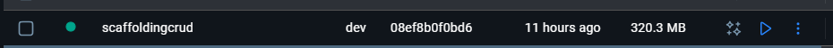
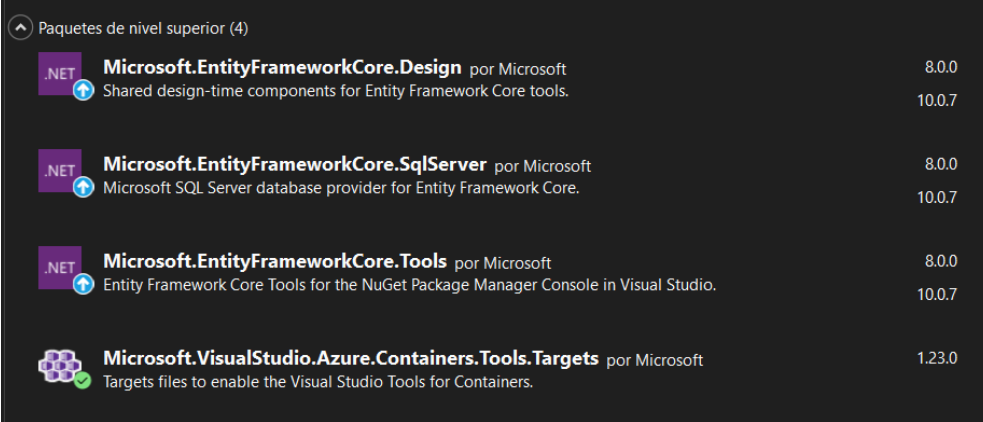
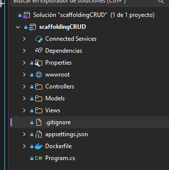
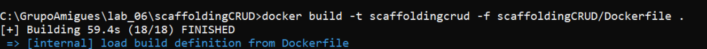
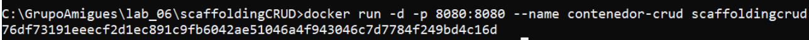
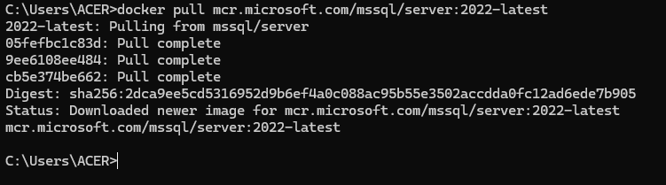
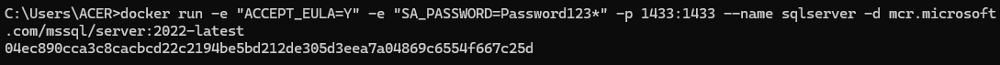
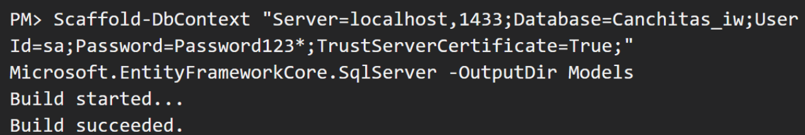
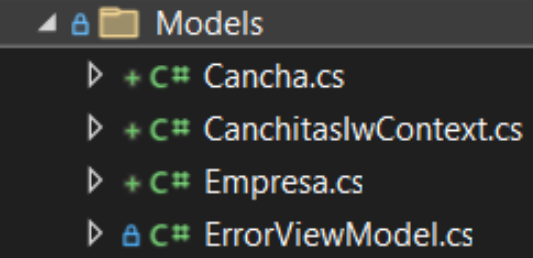

# Nombre del Proyecto: [Inserta aquí el título]

Breve descripción de qué hace la aplicación y cuál es su objetivo principal.

---

## 👥 Integrantes
* **Diego Nova Rosas** 
* **Renzo Murillo Alvarez** 
* **Angelica Castillo Tovar** 

---

## 1. Creación del Proyecto en Visual Studio (MVC)

Pasos seguidos para inicializar el entorno:

1.  Abrir **Visual Studio 2022**.
2.  Seleccionar **Crear un nuevo proyecto**.
3.  Elegir la plantilla **ASP.NET Core Web App (Model-View-Controller)**.
4.  Configurar el nombre del proyecto y la ubicación.
5.  **Configuración adicional:** Seleccionar .NET 8.0 (o la versión que uses) y marcar la casilla de **Habilitar Docker** (opcional desde el inicio).
6.  Luego instalar los paquetes correspondientes.

[Imagen de la configuración del proyecto en Visual Studio]







### Resultado del proyecto creado


---


---
## 2. Dockerización de la Aplicación

Para empaquetar la aplicación, se creó un archivo `Dockerfile` en la raíz del proyecto.
Con la configuración anterior todo sucede de manera automática, ahora vamos a mostrarles como se debería de desarrollar con comandos en docker sin interfaz.

### Contenido del Dockerfile

#### Creando la imagen:
```dockerfile
# Imagen base
```


#### Creando el contenedor y corriendo el mismo:



#### Los resultados que tenemos serían:


#### Ahora dockerizamos la base de datos:





---
## 3. Realizando el Scaffold dentro de .NET

Una vez terminado los pasos anteriores y se crearon las tablas en el contenedor de SQL. Debemos ejecutar lo siguiente en la intergaz de visual studio.



Se crean modelos en base a la base de datos que se configuro y creo anteriormente.




---