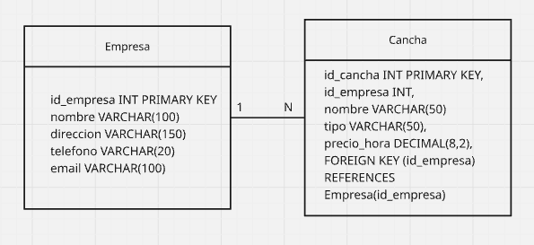
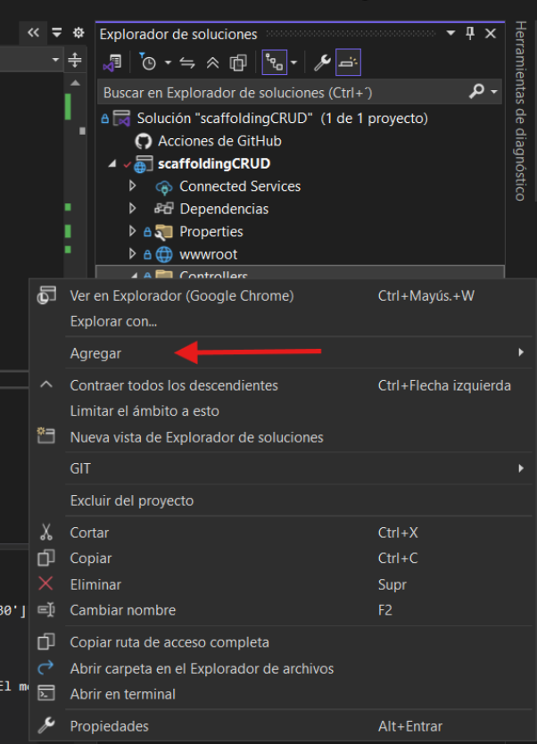
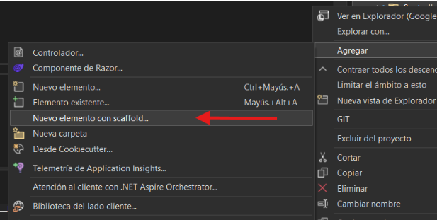
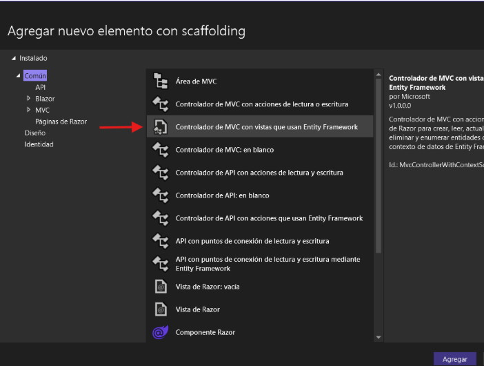
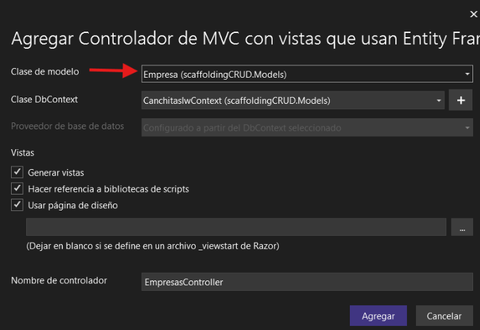
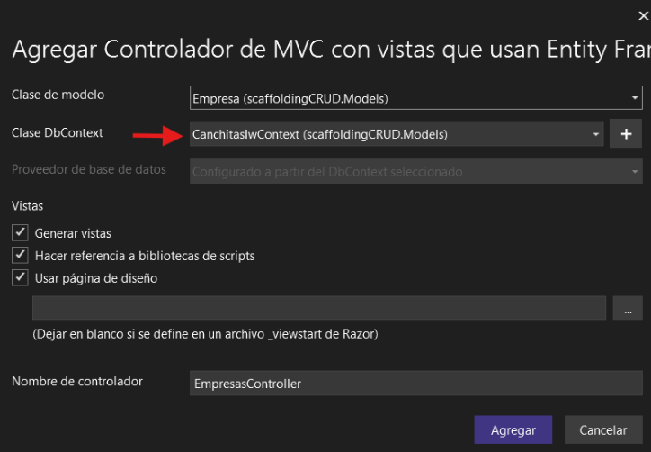
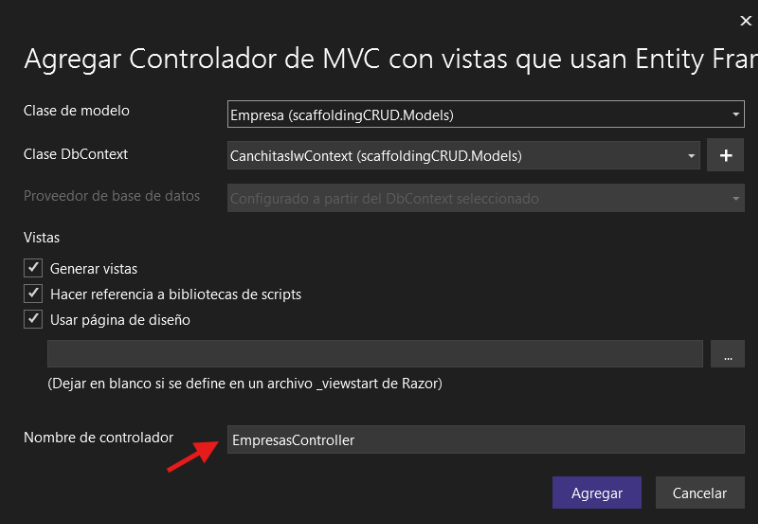

# Nombre del Proyecto: [ Sistema de reserva de canchas deportivas ]

Sistema web desarrollado en ASP.NET MVC que permite gestionar canchas deportivas mediante operaciones CRUD. Los usuarios pueden consultar la disponibilidad de canchas, realizar reservas y visualizar información relacionada con el rendimiento y uso de las instalaciones deportivas.

El proyecto utiliza Entity Framework y SQL Server para la administración de datos, siguiendo una arquitectura organizada basada en el patrón MVC.
	
---

## 👥 Integrantes
* **Diego Nova Rosas** 
* **Renzo Murillo Alvarez** 
* **Angelica Castillo Tovar** 
* **Marcelo Vieri Silva Cabrera**

---

---

# Descripción General del Proyecto

El sistema fue diseñado para facilitar la administración de canchas deportivas y mejorar el proceso de reservas.

Actualmente, el proyecto cuenta con dos entidades principales:

- **Cancha**
- **Empresa**

La relación entre ambas permite identificar qué empresa administra cada cancha deportiva.

## Modelo de Datos



---

---

# Administración de Carpetas del Proyecto

La estructura del proyecto se organizó siguiendo la arquitectura MVC de ASP.NET.

```text
scaffoldingCRUD/
│
├── Controllers/
├── Models/
├── Properties/
└── Views/
```

## Explicación de Carpetas

### Controllers
Contiene los controladores encargados de manejar las solicitudes del usuario y conectar las vistas con la lógica del sistema.

Aquí se implementan:
- CRUD de Canchas
- CRUD de Empresas
- Gestión de Reservas

---

---

### Models
Contiene las clases que representan las tablas de la base de datos.

En esta carpeta se encuentran modelos como:
- `Cancha`
- `Empresa`

Los modelos son generados mediante Entity Framework y Scaffolding.

---

### Properties
Incluye configuraciones generales del proyecto y archivos de propiedades de ASP.NET.

---

### Views
Contiene las interfaces visuales del sistema.

Aquí se encuentran:
- Formularios
- Tablas de registros
- Pantallas de edición
- Interfaces de reserva

---

# Funcionalidades Implementadas

## Gestión de Canchas

El sistema permite:

- Registrar canchas deportivas.
- Editar información de las canchas.
- Eliminar registros.
- Consultar disponibilidad.
- Visualizar listado de canchas.

---

## Gestión de Empresas

Se implementó un módulo CRUD para administrar las empresas responsables de las canchas deportivas.

Permite:
- Registrar empresas.
- Editar información.
- Eliminar registros.

---


## 1. Creación del Proyecto en Visual Studio (MVC)

Pasos seguidos para inicializar el entorno:

1.  Abrir **Visual Studio 2022**.
2.  Seleccionar **Crear un nuevo proyecto**.
3.  Elegir la plantilla **ASP.NET Core Web App (Model-View-Controller)**.
4.  Configurar el nombre del proyecto y la ubicación.
5.  **Configuración adicional:** Seleccionar .NET 8.0 (o la versión que uses) y marcar la casilla de **Habilitar Docker** (opcional desde el inicio).
6.  Luego instalar los paquetes correspondientes.

[Imagen de la configuración del proyecto en Visual Studio]


### Resultado del proyecto creado


---


---
## 2. Dockerización de la Aplicación

Para empaquetar la aplicación, se creó un archivo `Dockerfile` en la raíz del proyecto.
Con la configuración anterior todo sucede de manera automática, ahora vamos a mostrarles como se debería de desarrollar con comandos en docker sin interfaz.

### Contenido del Dockerfile

#### Creando la imagen:
```dockerfile
# Imagen base
```


#### Creando el contenedor y corriendo el mismo:


#### Los resultados que tenemos serían:


#### Ahora dockerizamos la base de datos:


---
## 3. Realizando el Scaffold dentro de .NET

Una vez terminado los pasos anteriores y se crearon las tablas en el contenedor de SQL. Debemos ejecutar lo siguiente en la intergaz de visual studio.


Se crean modelos en base a la base de datos que se configuro y creo anteriormente.


### Scaffold con controladores

- Click derecho en Directorio Controllers y en Agregar



- Seleccionar elemento con scaffold..



- Seleccionar controlador de MVC que usa entity framework



- Elegir el modelo que se desea crear



- Seleccionamos el context de la BD



- Nombrar al controller y agregamos



---